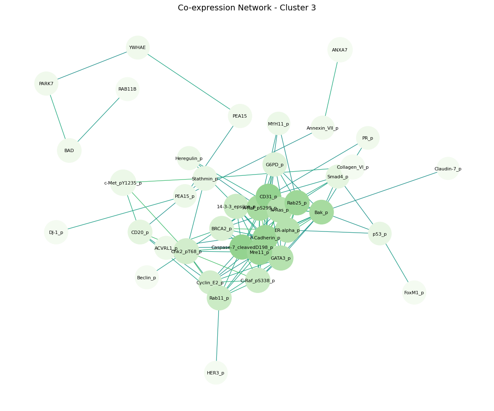
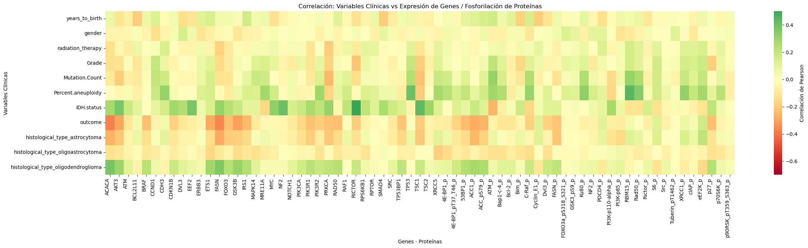
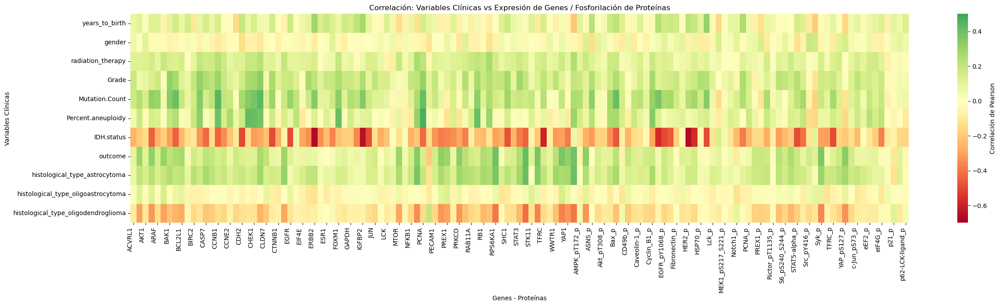
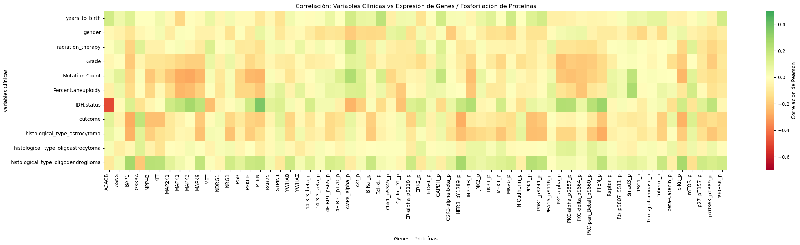
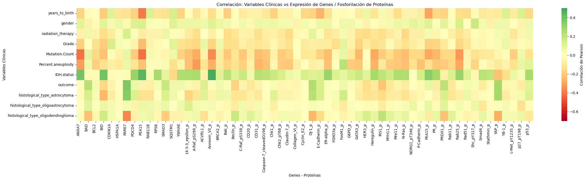
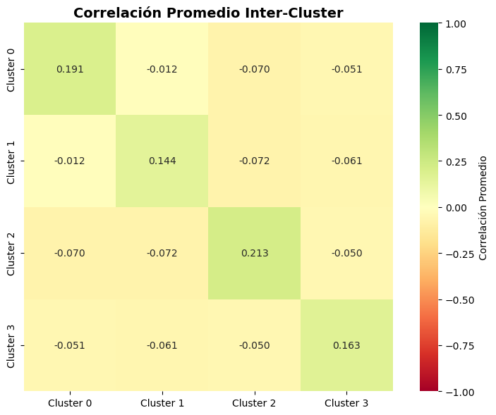

# Análisis de Clusters de Genes y Proteínas
Este subproyecto se centra en la identificación de patrones de coexpresión entre genes y proteínas en muestras de gliomas difusos mediante clustering jerárquico y análisis de redes.

⚠️ Estado: Análisis en progreso. Las conclusiones se actualizarán conforme se realicen análisis funcionales más profundos.

---

## 📊 Dataset

- Proteínas: 174  
- Genes: 145  
- Datos utilizados: Niveles de expresión estandarizados de genes y proteínas (tras escalado con StandardScaler de sklearn).

---

## 🔍 Metodología

**Preprocesamiento:**

- Estandarización de los niveles de expresión (media 0, desviación estándar 1).

**Clustering:**

- Clustering jerárquico de genes y proteínas basado en correlación de expresión.
- Se identificaron 4 clústeres principales:
  - Cluster 0: 69 genes/proteínas
  - Cluster 1: 129 genes/proteínas
  - Cluster 2: 62 genes/proteínas
  - Cluster 3: 59 genes/proteínas
- Heatmaps muestran alta correlación intracluster y baja correlación intercluster.

**Redes de coexpresión:**

- Se calculó la correlación promedio entre genes/proteínas dentro de cada cluster.
- Se construyeron redes filtrando correlaciones > 0.5 para identificar conexiones robustas.

**Análisis funcional preliminar:**

- Se realizó un análisis de enriquecimiento de vías y funciones usando KEGG, GO y Reactome para cada cluster.

---

## 🧬 Resultados Clave

### Clústeres

| Cluster | Características principales        | Genes/Proteínas Hub                  | Correlación promedio |
|---------|----------------------------------|-------------------------------------|--------------------|
| 0       | DNA Repair                        | 53BP1_p, Ku80_p, ACC_pS79_p         | ~0.3               |
| 1       | Apoptosis / Señalización          | STAT3, Bax, BAK1, CASP7, SHC1       | 0.24-0.28          |
| 2       | Señalización kinasa (MAPK/PI3K)  | MEK1_p, RAF, PDK1, p70S6K           | 0.33-0.40          |
| 3       | Proliferación / Adhesión          | Caspase-7_cleaved, P-Cadherin, CD31| 0.29-0.33          |

### Redes de coexpresión (umbral 0.5)

| Cluster | Centralidad máxima | Interpretación                             |
|---------|------------------|--------------------------------------------|
| 0       | 0.196            | Red fragmentada, pocas conexiones fuertes |
| 1       | 0.134            | Red dispersa, correlaciones fuertes raras |
| 2       | 0.38             | Vía coordinada y cohesiva                  |
| 3       | 0.41             | Muchas conexiones fuertes, hub bien conectado |

**Red con máxima centralidad**

### Correlaciones con variables clínicas

- **Cluster 0:** Ligera correlación positiva con oligodendroglioma e IDH mutado; correlación negativa con outcome adverso → asociado a fenotipo favorable.

- **Cluster 1:** Correlación positiva con astrocitoma, número de mutaciones, grado histológico alto, radioterapia y desenlace negativo; correlación negativa con IDH mutado → fenotipo menos favorable.

- **Cluster 2:** Baja correlación con variables clínicas → funciones housekeeping esenciales; ACACB correlaciona negativamente con IDH WT.

- **Cluster 3:** Media correlación con IDH mutado y baja correlación con otras variables; genes como ANXA7 y PEA15 vinculados al estado mutacional de IDH.

### Matriz de correlación intercluster

> Interpretación: Los clusters presentan alta correlación interna (valores en diagonal) y baja correlación intercluster (valores fuera de diagonal), lo que indica independencia funcional entre módulos.

---

## 🔬 Análisis Funcional Preliminar por Cluster

| Cluster | Genes analizados | Vías enriquecidas |
|---------|----------------|------------------|
| 0       | 48             | KEGG: PI3K-Akt, mTOR, AMPK, ErbB; GO BP: regulación negativa de apoptosis, ciclo celular; Reactome: señalización celular, PI3K/AKT en cáncer |
| 1       | 90             | KEGG: vías en cáncer, ErbB, PI3K-Akt, senescencia; GO BP: regulación de apoptosis y proliferación; GO MF: unión y actividad de quinasas y fosfatasas |
| 2       | 50             | KEGG: PI3K-Akt, mTOR, ErbB; GO BP: fosforilación y regulación de proliferación; GO MF: actividad quinasa serina/treonina y reguladores de quinasa |
| 3       | 55             | KEGG: PI3K-Akt, gastric cancer, colorectal cancer; GO BP: regulación negativa de proliferación y apoptosis; GO MF: unión a quinasas y factores de transcripción |

---

## 🛠 Tecnologías y Herramientas

- Lenguajes: Python 🐍
- Librerías: pandas, numpy, matplotlib, seaborn, scipy.cluster.hierarchy, sklearn, networkx, gseapy, mygene
- Visualización: Heatmaps, dendrogramas, redes de correlación
