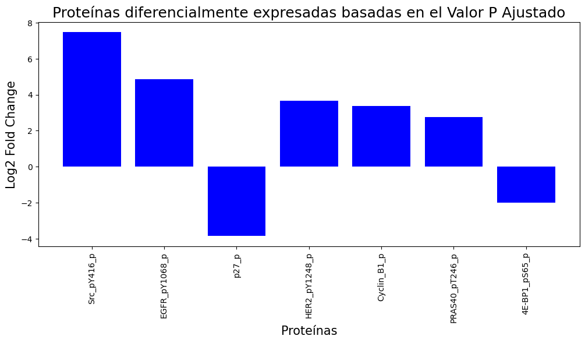
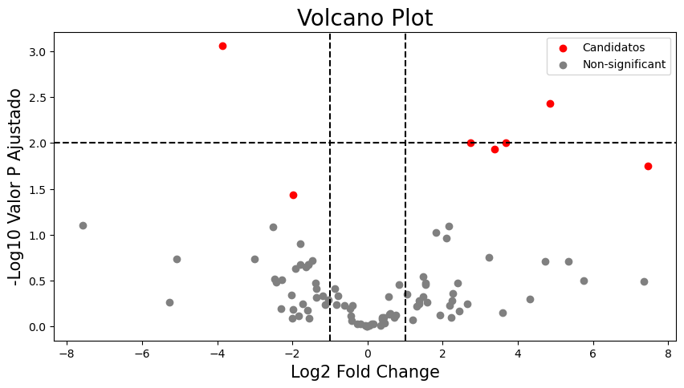
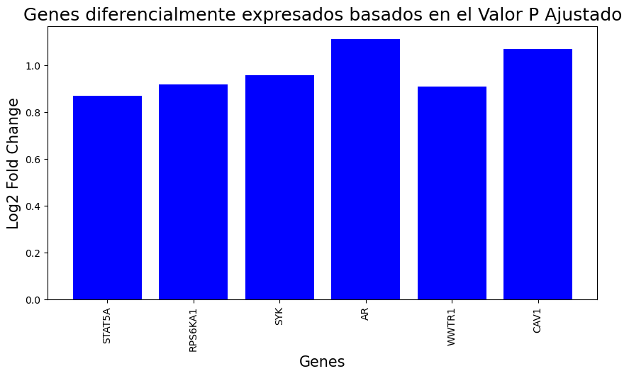
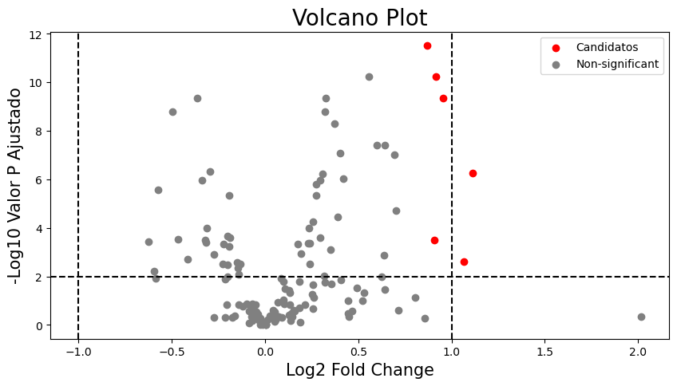

# Análisis Univariado de Datos Moleculares en Gliomas Difusos - Optención de Biomarcadores

Este proyecto se centra en el análisis univariado de datos de expresión proteica y génica en pacientes con gliomas difusos. El objetivo es identificar proteínas y genes cuya expresión se asocie significativamente con el outcome clínico de los pacientes.

⚠️ Estado: Análisis en progreso.

## Dataset

El dataset incluye:

- Proteómica: expresión relativa de 174 proteínas. Se realizó imputación de valores faltantes y escalado de los datos.

- Transcriptómica: expresión de 145 transcritos.

## Metodología

### **Proteómica:**

- Imputación de datos faltantes

- Escalado estándar (z-score)

- Análisis univariado para evaluar la significancia de cada proteína respecto al outcome clínico (adj.P.Val < 0.05).

- Se reporta también el log2 fold change (logFC) para evaluar la magnitud del cambio en expresión.

Resultados Univariados
Proteínas Significativas (adj.P.Val < 0.05)

### **Transcriptómica:**

Análisis univariado por cada gen, usando valores ajustados de p (adj.P.Val) y logFC.

Nota: logFC positivo indica sobreexpresión en el grupo de interés; logFC negativo indica subexpresión.

## Tecnologías y Herramientas

- Lenguaje: Python 🐍

- Librerías: pandas, NumPy, SciPy, Matplotlib, Seaborn

- Procesamiento: imputación, escalado, análisis estadístico univariado
