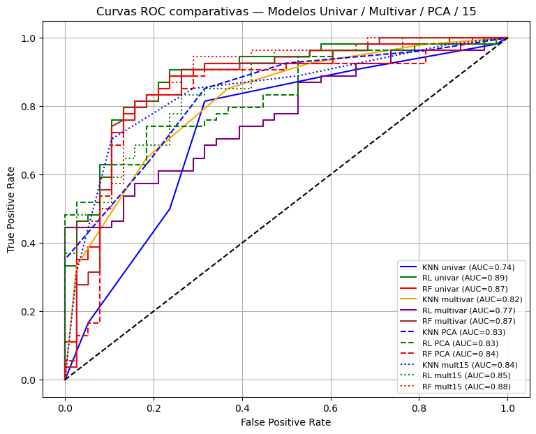
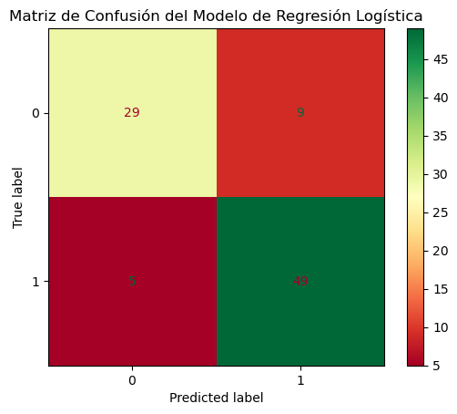
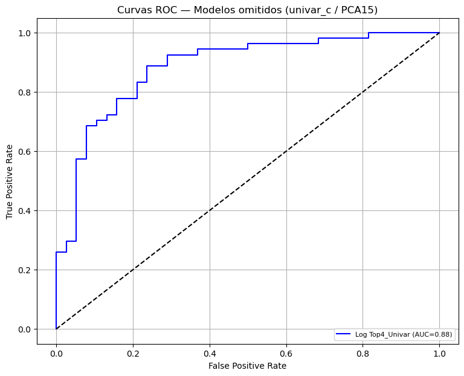
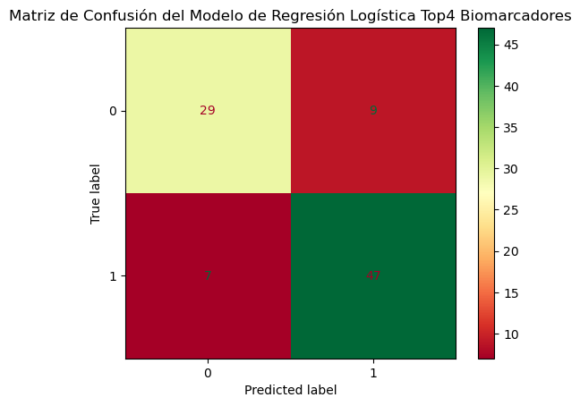

# 🧠 Predicción del Estado de Pacientes con Gliomas Difusos mediante Machine Learning y Biomarcadores Ómicos

Este proyecto tiene como objetivo **predecir el estado clínico (supervivencia o muerte)** de pacientes con gliomas difusos utilizando datos **ómicos** (proteómica y transcriptómica) combinados con técnicas de **machine learning**.

Se evaluaron distintos enfoques para la **selección de biomarcadores**, incluyendo análisis univariado y multivariado, y se implementaron diversos modelos de clasificación para comparar su desempeño predictivo.

El propósito principal fue **comparar la capacidad de predicción del estado del paciente** —y, por extensión, de la agresividad tumoral— usando biomarcadores obtenidos mediante métodos univariados y multivariados, y determinar si existe una diferencia significativa en su poder predictivo.

Se buscó **identificar el mejor modelo posible**, optimizando la precisión mientras se minimiza el número de biomarcadores, con el fin de lograr **predicciones confiables a menor costo**.

Cabe destacar que los resultados podrían mejorarse al integrar datos clínicos tradicionales junto con los biomarcadores ómicos.

---

## 📊 Dataset

Se trabajó con datos de expresión **proteica** y **génica** de pacientes con gliomas difusos:

- **Proteómica:** 174 proteínas relacionadas con señalización y regulación celular.  
- **Transcriptómica:** 145 transcritos.  

Los datos fueron preprocesados mediante **normalización**, **escalado** y, en el caso del análisis univariado, **imputación de valores faltantes**.

---

## 🔬 Selección de Biomarcadores

### 🔹 Análisis Univariado

Se evaluó la asociación de cada proteína y gen con el **outcome clínico** individualmente.

**Criterios de selección:**
- Ajuste de p-value (adj.P.Val) < 0.05  
- Log2 fold change (logFC) para magnitud del cambio  

**Ejemplos de resultados:**

**Proteínas significativas (adj.P.Val < 0.05)**  

| Protein       | adj.P.Val | logFC  |
|---------------|-----------|--------|
| Src_pY416_p   | 0.0177    | 7.463  |
| EGFR_pY1068_p | 0.0037    | 4.844  |
| p27_p         | 0.00088   | -3.858 |

**Genes significativos**  

| Gene.symbol | adj.P.Val | logFC  |
|--------------|-----------|--------|
| STAT5A       | 3.07e-12  | 0.870  |
| RPS6KA1      | 5.62e-11  | 0.917  |
| SYK          | 4.48e-10  | 0.955  |

---

### 🔹 Análisis Multivariado

Se integraron datos proteómicos y transcriptómicos usando **Partial Least Squares (PLS)**.  
Se calculó **VIP (Variable Importance in Projection)** para identificar las variables más relevantes, considerando significativas aquellas con **VIP > 1.0**.

**Ejemplo top 10 proteínas y genes:**

**Proteínas relevantes (VIP > 1.0)**  

| Rank | Proteína    | VIP   |
|------|--------------|-------|
| 1    | Syk_p        | 2.047 |
| 2    | YAP_pS127_p  | 1.887 |
| 3    | AR_p         | 1.840 |

**Genes relevantes (VIP > 1.0)**  

| Rank | Gen       | VIP   |
|------|------------|-------|
| 1    | STAT5A    | 2.327 |
| 2    | YBX1      | 2.326 |
| 3    | XRCC1     | 2.197 |

---

## 🔁 Análisis de Correlación y Expresión

El **heatmap** muestra la matriz de correlación entre los biomarcadores seleccionados en el análisis univariado y el **outcome clínico** (supervivencia o muerte).  
En general, las correlaciones son **moderadas**, aunque se observa un **grupo de marcadores altamente relacionados entre sí** —principalmente **STAT5A, RPS6KA1, SYK y AR**— que además presentan las correlaciones más altas con el outcome, sugiriendo que **actúan de forma coordinada dentro de una misma vía de señalización asociada a la progresión tumoral o la supervivencia**.  

En contraste, biomarcadores como **EGFR, HER2 y Src** muestran fuerte correlación entre ellos pero una asociación más débil con el desenlace clínico, indicando que reflejan activación de **vías upstream** sin ser directamente predictivos.  

El **boxplot** evidencia que **STAT5A, RPS6KA1, SYK y AR** presentan una **sobreexpresión consistente en pacientes fallecidos**, respaldando su papel como posibles **indicadores de mal pronóstico** y su **relevancia en el modelo predictivo**.  

En conjunto, el patrón observado sugiere que los biomarcadores derivados del análisis univariado **capturan relaciones biológicas relevantes**, y que el **módulo STAT5A–RPS6KA1–SYK–AR** podría representar una **firma molecular con valor pronóstico** en gliomas.

---

## 🤖 Modelos de Machine Learning

Se construyeron modelos usando distintos conjuntos de biomarcadores:

1. **Univariado:** solo biomarcadores obtenidos del análisis univariado  
2. **Univariado ampliado:** biomarcadores univariados + número de mutaciones + grado histológico  
3. **Multivariado:** biomarcadores obtenidos del análisis multivariado  
4. **Multivariado con PCA:** misma selección multivariada, reducida a componentes principales (mejor PCA = 55)  
5. **Multivariado VIP > 1.5:** selección más estricta (VIP > 1.5)  
6. **Multivariado VIP > 1.5 + PCA:** reducción PCA (mejor PCA = 25)  
7. **Modelo reducido (4 biomarcadores):** STAT5A, RPS6KA1, SYK y AR  

**Modelos implementados:**
- K-Nearest Neighbors (KNN)  
- Regresión Logística  
- Random Forest  

---

## 📈 Evaluación de Modelos

El desempeño se evaluó mediante:

- **AUC-ROC**  
- **Precisión (accuracy)**  
- **Matriz de confusión**  

**Mejor modelo obtenido (modelo base):**

- **Regresión Logística (análisis univariado completo)**  
- **AUC-ROC:** 0.89  
- **Precisión:** 0.847  

**Matriz de confusión optimizada (criterio de Youden):**

**Modelo reducido (4 biomarcadores con mayor correlación):**

- **Regresión Logística (STAT5A, RPS6KA1, SYK, AR)**  
- **AUC-ROC:** 0.88

  
  
- **Precisión:** 0.8369  
  

👉 Este resultado demuestra que **solo cuatro biomarcadores** bastan para alcanzar una **precisión comparable al modelo completo**, evidenciando su **alto poder predictivo y relevancia biológica**.

---

## 🧰 Tecnologías y Herramientas

- **Lenguaje:** Python 🐍  
- **Librerías:** pandas, NumPy, SciPy, scikit-learn, Matplotlib, Seaborn  
- **Procesamiento de datos:** normalización, escalado, PCA  
- **Análisis multivariado:** PLS, VIP  

---

## 🧩 Conclusión

Este estudio demuestra que es posible **predecir con alta precisión el estado clínico de pacientes con gliomas difusos** mediante biomarcadores ómicos.  
La combinación de **análisis univariado** y **regresión logística** proporcionó el mejor desempeño global (**AUC-ROC = 0.89**, **precisión = 84.7%**).  

De forma destacable, el **modelo reducido basado únicamente en los biomarcadores STAT5A, RPS6KA1, SYK y AR** alcanzó una **AUC-ROC de 0.88** y una **precisión del 83.69%**, demostrando que estos cuatro marcadores son suficientes para generar un **pronóstico confiable y biológicamente interpretable**.  

Estos resultados sugieren que el **módulo STAT5A–RPS6KA1–SYK–AR** podría constituir una **firma molecular de mal pronóstico** en gliomas, posiblemente vinculada a la **activación coordinada de rutas de señalización** relacionadas con la **supervivencia celular y la resistencia tumoral**.  

Finalmente, integrar estos biomarcadores con **datos clínicos tradicionales** podría potenciar aún más la **precisión y aplicabilidad** del modelo en entornos reales de diagnóstico y seguimiento oncológico.
